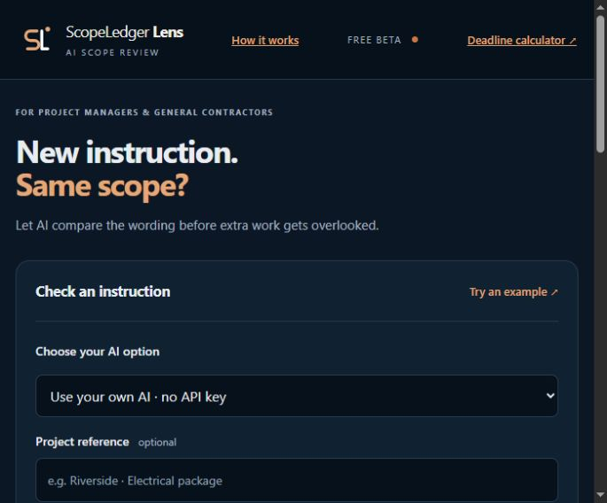

# ScopeLedger Lens

**A free, open-source AI scope check for construction project managers and general contractors.**

Compare the agreed scope with a new instruction. Find potential extra work, apparently covered items and missing context. Every finding must quote the text you supplied.

**Use your own AI chat. No API key is required for the default flow.** Lens prepares a prompt; you run it in ChatGPT, Claude or another chat and paste its JSON answer back. Lens checks the quotes in your browser. Free chat accounts have usage limits. This is a manual handoff, not account linking.



## Run the app

Requires Node.js 22 or newer. No package installation or database is needed.

1. Download or clone this repository.
2. Open a terminal in its folder.
3. Run:

```sh
npm start
```

4. Open http://127.0.0.1:4173/ in your browser.

On Windows, you can also use `Start-Lens.cmd`. Install Node.js if it is not available. Keep the server running while using the app.

## Use your own AI

1. Paste the relevant agreed scope and new instruction. Keep their original wording.
2. Remove private details you do not need. Confirm you may share the text.
3. Select **Use your own AI** and prepare the prompt.
4. Copy it into your AI chat. Sign in with that provider directly.
5. Paste the full JSON answer into Lens. Click **Check quotes and show review**.
6. Review the findings against the complete documents. Download the review or prepare a clarification draft.

Editing the source text clears the pending prompt and previous review. The app includes an illustrative sample, which is labelled as prewritten. The **How it works** page explains the steps in plain English.

## What it checks

- Exact scope and instruction quotes, including punctuation and case.
- Required fields, allowed labels and bounded output sizes.
- Overall classification derived from the individual findings.

A wrong quote rejects the whole answer. A correct quote does **not** prove that the AI understood it correctly. Human review remains essential.

Lens does not determine payment rights, approve work, set prices or calculate notice deadlines. Omitted amendments, drawings, precedence rules and approvals can change the conclusion. Follow the complete contract and safety requirements.

## Privacy and costs

In **Use your own AI** mode, prompt preparation and answer checks happen locally in the browser. Lens makes no AI request for you. You decide what to paste into your provider's chat; that provider's privacy rules apply. Lens does not request your AI password or API key.

Text and results stay in page memory. The app has no database, localStorage, analytics or content logging. Refreshing, closing or clearing the page removes the session. Hosting and browser behaviour are outside the app's controls.

## Optional hosted AI

The app can also make a server-side OpenAI request. This is optional and incurs API charges.

Copy `.env.example` to `.env`, set `OPENAI_API_KEY`, and restart. Keep the key private. `OPENAI_MODEL` defaults to `gpt-4.1-mini`; alternatives must support the Responses API and strict JSON output. Requests use `store: false`, which does not guarantee zero provider retention.

The optional server flow handles refusals, incomplete results, timeouts and provider errors. Limits allow one request at a time, one per address per minute and 30 per UTC day by default. Failed requests count. Limits reset on restart and are per process; they are not durable billing controls.

The server binds to localhost. A non-loopback host requires `APP_ACCESS_TOKEN`. Use HTTPS for remote access. Before a public hosted-AI launch, add durable abuse and spend controls and an appropriate privacy notice. **This repository is public source code, not a deployed service.**

Set `REVIEW_URL` to a real HTTPS contact page to offer a human review link. Otherwise Lens downloads a review request and makes clear that it has not submitted anything.

## For AI agents

Use [the scope-exposure-review skill](skills/scope-exposure-review/SKILL.md) to apply the same evidence-first review method in your agent environment.

Copy the `skills/scope-exposure-review` folder into your agent's skills directory. For Codex, this is normally `~/.codex/skills/`. The skill describes the method; it does not connect accounts, send notices or establish contractual rights. See [AGENTS.md](AGENTS.md) for repository development guidance.

## Share it

[Ready-to-paste social copy](SOCIAL.md) includes a short post, a longer post and a reusable link block. No automatic publishing is included.

Related ScopeLedger tool: [Notice Deadline Calculator](https://github.com/AI-Ops1/scopeledger-notice-calculator). It is a separate tool. Verify the applicable notice terms before using a deadline calculation.

## Test and limitations

```sh
npm test
```

Tests cover validation, fabricated quotes, classification, manual imports, provider failures, request controls and secret-file isolation. They use synthetic text and mocked provider calls. They incur no AI spend and do not establish real-model accuracy.

Before relying on the app on live projects, evaluate authorised or synthetic examples with a competent construction reviewer. Include exclusions, included work, ambiguity, revised documents and multi-item instructions. Do not claim measured accuracy without that evaluation.

## Brand and licence

ScopeLedger Lens is a working product name. The editable SL monogram in `public/logo.svg` uses deep green and lime; it is a related concept, not a verified match to an existing logo. No trademark clearance is claimed.

MIT licence. Built by [AI-Ops1](https://github.com/AI-Ops1).

Technical references: [Structured Outputs](https://developers.openai.com/api/docs/guides/structured-outputs), [OpenAI data controls](https://developers.openai.com/api/docs/guides/your-data).

## Deadline calculator and agent skill

The main menu links to [the live calculator](https://ai-ops1.github.io/scopeledger-notice-calculator/). How it works includes its calendar-day method, [Chrome extension](https://chromewebstore.google.com/detail/notice-deadline-calculato/bncibbamfhacacpbnnfbhlkkooeedgnj) and [downloadable agent skill](https://github.com/AI-Ops1/scopeledger-notice-calculator/releases/latest/download/notice-deadline-calculator-skill.zip).
